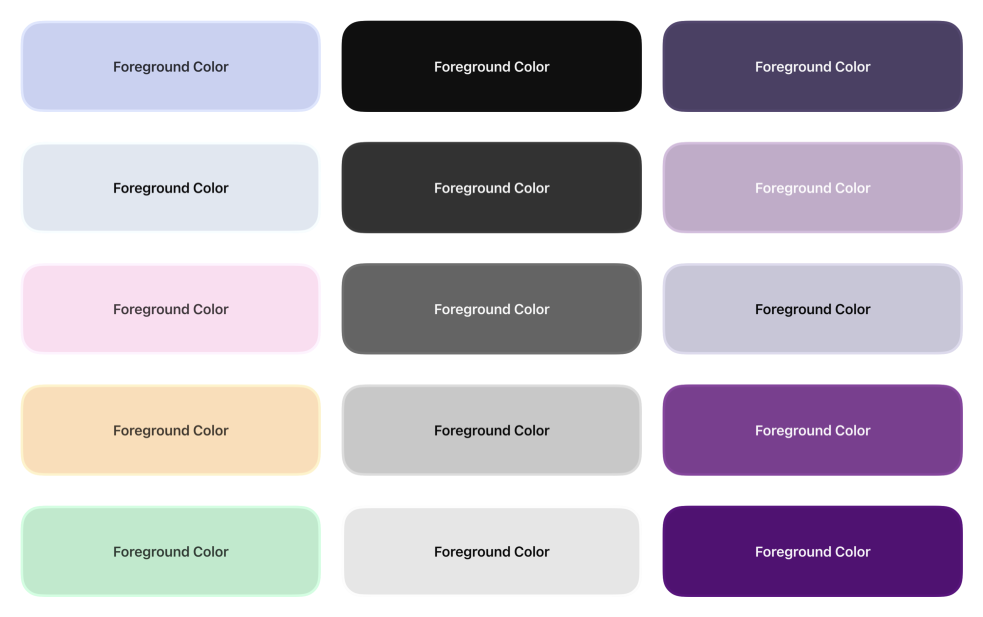

  
  <h1><b>Garnish</b></h1>
  
A Swift package for iOS and macOS that provides intelligent color utilities for accessibility, contrast optimization, and visual harmony.

  
    
  
  
  
  
  

---

## **What is Garnish?**

Garnish is a comprehensive Swift package that provides intelligent color utilities for:
- **Contrast Optimization** - Generate colors that meet WCAG accessibility standards
- **Dynamic Color Adaptation** - Colors that work beautifully in light and dark themes
- **Mathematical Color Analysis** - Precise luminance, brightness, and contrast calculations
- **Smart Color Generation** - Create contrasting shades and optimized color combinations

## **Core Features**

### 🎨 **Smart Color Generation** - Intelligent Contrast
Generate contrasting colors that maintain visual harmony:

|  |  |  |
|:---:|:---:|:---:|
| **Contrasting Shades** | **Color Optimization** | **Dynamic Themes** |
| Same-hue contrasting colors | Optimize colors against backgrounds | Light and dark theme adaptation |

### ♿ **Accessibility & WCAG Compliance** - Standards Built-in
Ensure your colors meet accessibility requirements:
- WCAG AA and AAA contrast ratio validation
- Real-time contrast calculations
- Accessibility-first color recommendations
- Font weight optimization for readability

## **Documentation**

**📖 [Complete Documentation](https://github.com/Aeastr/Garnish/wiki)** available in the Garnish Wiki

---

## Playground Demos

Garnish comes with a bundled demo app that lets you explore Garnish in action. Open the Xcode workspace, select the `GarnishDemo` target, and press **Run** to try it out.

### Core API Demo

The **Core API** tab demonstrates monochromatic and bi-chromatic contrast generation with live color previews.

### Color Extensions Demo

The **Color Extensions** tab showcases brightness adjustment, hex conversion, and convenience methods with real-time feedback.

### Accessibility Demo

The **Accessibility** tab provides WCAG compliance checking with visual contrast examples and pass/fail indicators.

---

## License

This project is released under the MIT License. See [LICENSE](LICENSE) for details.

## Contributing

Contributions are welcome! Please feel free to submit a Pull Request! See [CONTRIBUTING.md](CONTRIBUTING.md) for guidelines.

## Support

If you like this project, please consider giving it a ⭐️

---

## Where to find me:  
- here, obviously.  
- [Twitter](https://x.com/AetherAurelia)  
- [Threads](https://www.threads.net/@aetheraurelia)  
- [Bluesky](https://bsky.app/profile/aethers.world)  
- [Join the Kyo Discord](https://discord.gg/6NHhAvwbXV)

---

Built with 🍏🎨🌈 by Aether
