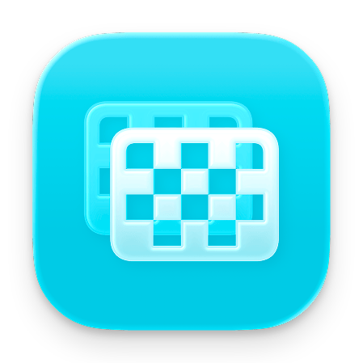
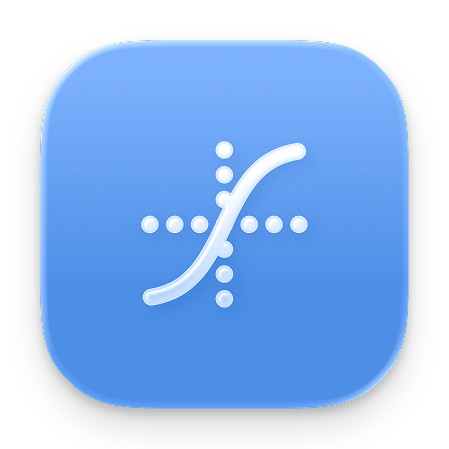
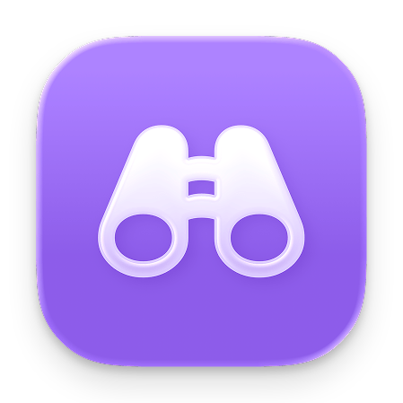

  
  <h1><b>Garnish</b></h1>
  
A Swift package that provides intelligent color utilities for accessibility, contrast optimization, and visual harmony.

  
    
  
  
  
  
  

## **Core Features**

Garnish is a comprehensive Swift package that provides intelligent color utilities for accessibility, contrast optimization, and visual harmony.

|  |  |  |
|:---:|:---:|:---:|
| **Auto Contrast** | **Color Math** | **Color Analysis** |
| Automatically generate readable text colors from any background | Calculate luminance, brightness, and contrast ratios with WCAG standards | Classify colors as light/dark and validate accessibility compliance |

### ♿ **Accessibility & WCAG Compliance** - Standards Built-in
Ensure your colors meet accessibility requirements:
- **Contrast Optimization** - Generate colors that meet WCAG accessibility standards
- **Dynamic Color Adaptation** - Colors that work beautifully in light and dark themes
- **Mathematical Color Analysis** - Precise luminance, brightness, and contrast calculations
- **Smart Color Generation** - Create contrasting shades and optimized color combinations
- **Real-time contrast calculations** and accessibility-first color recommendations
- **Font weight optimization** for improved readability

## **Documentation**

**📖 [Complete Documentation](https://github.com/Aeastr/Garnish/wiki)** available in the Garnish Wiki

---

## Playground Demos

Garnish comes with a bundled demo app that lets you explore Garnish in action. Open the Xcode workspace, select the `GarnishPlayground` target, and press **Run** to try it out.

### Garnish Base Demo
Explore the core color utilities with interactive demos for **Core API** (monochromatic and bi-chromatic contrast generation), **Math Utilities** (luminance calculations and contrast ratios), **Color Extensions** (brightness adjustment and hex conversion), **Font Weight** optimization, and **Accessibility** compliance checking with WCAG standards.

### GarnishTheme Demo  
Discover the theming system with demos for **Theme Registration**, **Built-in Themes** (Default, Dark, Ocean, Rose), **Current Theme API**, **Custom Theme Creation**, **Color Keys System**, and **Theme Comparison** tools for building flexible, dynamic app themes.

## License

This project is released under the MIT License. See [LICENSE](LICENSE) for details.

## Contributing

Contributions are welcome! Please feel free to submit a Pull Request! See [CONTRIBUTING.md](CONTRIBUTING.md) for guidelines.

## Support

If you like this project, please consider giving it a ⭐️

---

## Where to find me:  
- here, obviously.  
- [Twitter](https://x.com/AetherAurelia)  
- [Threads](https://www.threads.net/@aetheraurelia)  
- [Bluesky](https://bsky.app/profile/aethers.world)  
- [Join the Discord](https://discord.gg/6NHhAvwbXV)

---

Built with 🍏🎨🌈 by Aether

